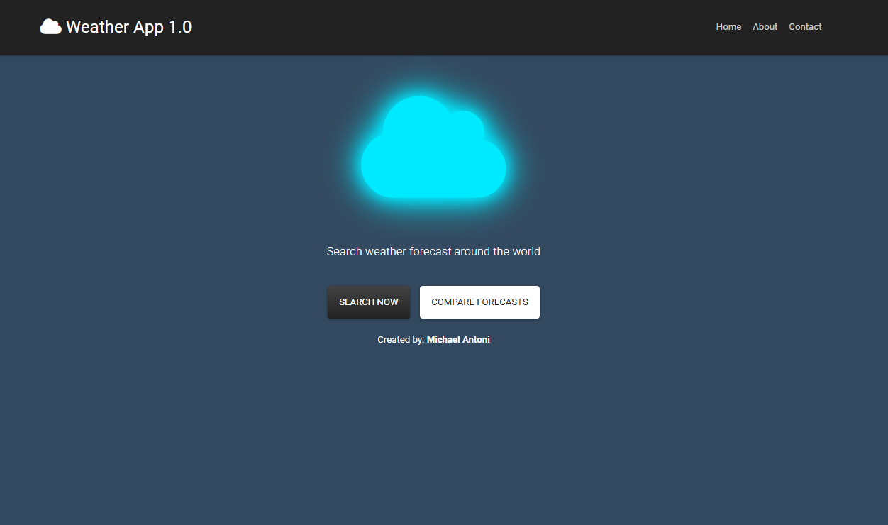

# 🌤 Weather App

A pretty simple and straightforward weather forecast application built with **React** and the **React Context API**. It allows users to **search for weather forecasts by city or country** and even **compare two weather forecasts** side-by-side. This project integrates with the **OpenWeatherMap API** to fetch live and accurate weather data.

**Visit Here:** [https://m-antoni-weather.vercel.app](https://m-antoni-weather.vercel.app)
<br/>
**Live Demo:** https://youtu.be/SwxnO81hS9c




## Features

- Search weather forecasts by **city** or **country**
- Compare forecasts between two different locations
- Built with **React Context API** for global state management
- Smooth and minimal **animations**
- **iziToast** notifications for clean user feedback
- Responsive, simple UI

---

## Tech Stack

| Technology | Purpose |
|-------------|----------|
| **React** | Front-end framework for building the UI |
| **React Context API** | Handles global state and data sharing across components |
| **iziToast** | Displays interactive toast notifications |
| **OpenWeatherMap API** | Provides live weather forecast data |


## Setup Instructions

1. **Clone this repository**
   ```bash
   git clone https://github.com/m-antoni/weather-app.git
   cd weather-app
   ```

2. **Install dependencies**
   ```bash
   npm install
   ```

3. **Create a `.env` file** in the project root and add your OpenWeatherMap API key:
   ```bash
   REACT_APP_API_KEY=your_openweathermap_api_key_here
   ```

4. **Run the app locally**
   ```bash
   npm start
   ```

5. **Build for production**
   ```bash
   npm run build
   ```


## API Reference

This app uses the [OpenWeatherMap API](https://openweathermap.org/api).  
You’ll need to sign up for a free API key to fetch weather data.

Example endpoint:
```
https://api.openweathermap.org/data/2.5/weather?q=London&appid=YOUR_API_KEY
```


## Deployment

You can deploy this app on **Vercel**, **Netlify**, or any React-compatible hosting service.

Make sure to include your environment variable (`REACT_APP_API_KEY`) in your host’s environment settings.


## License

This project is open source and available under the [MIT License](LICENSE).

---
## Author

**Michael B. Antoni**  
LinkedIn: [https://linkedin.com/in/m-antoni](https://linkedin.com/in/m-antoni)  
Email: michaelantoni.tech@gmail.com
